# UR.RTDE.Grasshopper

[](https://yak.rhino3d.com/packages/UR-RTDE-Grasshopper)
[](https://yak.rhino3d.com/packages/UR-RTDE-Grasshopper)
[](https://www.rhino3d.com/)
[](LICENSE)

Grasshopper components to control Universal Robots via UR.RTDE (C# wrapper). Supports session management, reads (joints/pose/IO/modes), and basic commands.

## Installation

### Via Rhino Package Manager (Recommended for Rhino 8)

1. Open Rhino 8
2. Go to **Tools** → **Package Manager** (or press `Ctrl+Shift+P`)
3. Search for **UR-RTDE-Grasshopper**
4. Click **Install**

The Rhino Package Manager is the easiest way to install and manage the package.

### Via Yak Command Line

Alternatively, you can install via the command line:

```bash
yak install UR-RTDE-Grasshopper
```

### Manual Installation

Copy the built `.gha` file to your Grasshopper Libraries folder:
- **Windows**: `%AppData%\Grasshopper\Libraries`

## Quick Start

1. **Connect to your robot** using the `UR Session` component
   - Set the robot's IP address (default: `127.0.0.1` for URSim)
   - Click "Connect" to establish the RTDE connection

2. **Read robot state** with the `UR Read` component
   - Use the context menu to select: Joints, Pose, IO, or Modes
   - Enable "Auto listen" for periodic updates without a Timer

3. **Send commands** with the `UR Command` component
   - Use context menu: MoveJ, MoveL, StopJ, StopL, or SetDO
   - Configure speed, acceleration, and other parameters

**⚠️ Important**: Always test with URSim first before connecting to real hardware!

## Component Connections

The following diagram shows how the components connect together in a typical workflow:

```mermaid
flowchart TB
    subgraph Inputs["📥 Configuration Inputs"]
        IP["`**IP**<br/>Text<br/>Default: 127.0.0.1`"]
        Timeout["`**Timeout**<br/>Integer (ms)<br/>Default: 2000`"]
        Reconnect["`**Reconnect**<br/>Boolean<br/>Default: false`"]
    end
    
    subgraph SessionGroup["🔌 UR Session Component"]
        Session["`**UR Session**<br/>━━━━━━━━━━━━━━━━<br/>**Outputs:**<br/>📤 Session (URSession)<br/>📊 Connected (Boolean)<br/>📝 Status (Text)<br/>⚠️ Last Error (Text)`"]
    end
    
    subgraph ReadGroup["👁️ UR Read Component"]
        Read["`**UR Read**<br/>━━━━━━━━━━━━━━━━<br/>**Input:**<br/>📥 Session (URSession)<br/>━━━━━━━━━━━━━━━━<br/>**Outputs:**<br/>📤 Data (varies by mode)<br/>📝 Message (Text)<br/>━━━━━━━━━━━━━━━━<br/>**Read Modes:**<br/>• Joints → 6 numbers<br/>• Pose → Plane<br/>• IO → Tree<br/>• Modes → Tree`"]
    end
    
    subgraph CommandGroup["🚀 UR Command Component"]
        Command["`**UR Command**<br/>(MoveJ example)<br/>━━━━━━━━━━━━━━━━<br/>**Inputs:**<br/>📥 Session (URSession)<br/>📥 Joints [6] ⚠️ required<br/>📥 Speed (optional)<br/>📥 Acceleration (optional)<br/>📥 Async (optional)<br/>📥 Sequential (optional)<br/>📥 Stop on Error (optional)<br/>━━━━━━━━━━━━━━━━<br/>**Outputs:**<br/>✅ OK (Boolean)<br/>📝 Message (Text)`"]
    end
    
    subgraph CommandInputs["📥 Command Parameters"]
        Joints["`**Joints**<br/>6 numbers (rad)<br/>[q0, q1, q2, q3, q4, q5]`"]
        Speed["`**Speed**<br/>Number<br/>Default: 1.05`"]
        Accel["`**Acceleration**<br/>Number<br/>Default: 1.4`"]
    end
    
    %% Connections
    IP --> Session
    Timeout --> Session
    Reconnect --> Session
    
    Session -->|"Session"| Read
    Session -->|"Session"| Command
    
    Joints --> Command
    Speed --> Command
    Accel --> Command
    
    %% Styling
    classDef inputStyle fill:#e3f2fd,stroke:#1976d2,stroke-width:2px,color:#000
    classDef componentStyle fill:#fff3e0,stroke:#f57c00,stroke-width:3px,color:#000
    classDef sessionStyle fill:#e8f5e9,stroke:#388e3c,stroke-width:3px,color:#000
    classDef subgraphStyle fill:#f5f5f5,stroke:#757575,stroke-width:2px
    
    class IP,Timeout,Reconnect,Joints,Speed,Accel inputStyle
    class Read,Command componentStyle
    class Session sessionStyle
```



**Typical Workflow:**
1. Configure **UR Session** with robot IP address (and optional timeout/reconnect)
2. Connect the **Session** output to both **UR Read** and **UR Command** components
3. Use **UR Read** to monitor robot state (joints, pose, IO, or modes)
4. Use **UR Command** to send movement or control commands to the robot

**Note:** The **UR Command** component's inputs change dynamically based on the selected action (MoveJ, MoveL, StopJ, StopL, or SetDO). The diagram above shows the MoveJ configuration as an example.

## Components

### UR Session
Manages the RTDE connection to the Universal Robot.

**Inputs:**
- `ip` - Robot IP address (optional, defaults to `127.0.0.1`)
- `timeout_ms` - Connection timeout in milliseconds (optional, defaults to `2000`)
- `reconnect` - Auto-reconnect on disconnect (optional, defaults to `false`)

**Outputs:**
- `session` - Session object for use with other components
- `is_connected` - Connection status (boolean)
- `status` - Connection status message
- `last_error` - Last error message if any

**Features:**
- Visual connection indicator (green point when connected)
- Connect/Disconnect button on the component

### UR Read
Reads robot state data from the robot.

**Context Menu Options:**
- **Joints** - Read joint angles `[q0..q5]` (radians)
- **Pose** - Read TCP pose as a Plane (converted from `[x,y,z,rx,ry,rz]` in m, rad)
- **IO** - Read digital/analog IO states
  - `{0}`: Digital inputs `din[0..17]` (bools)
  - `{1}`: Digital outputs `dout[0..17]` (bools)
  - `{2}`: Analog IO `[ai0, ai1, ao0, ao1]`
- **Modes** - Read robot and safety modes
  - `{0}`: Robot mode (label + code)
  - `{1}`: Safety mode (label + code)
  - `{2}`: Program running (bool)

**Auto Listen Feature:**
- Enable from context menu: "Auto listen (schedule reads)"
- Interval presets: 20, 50, 100, 200, 500, 1000 ms
- Automatically schedules periodic reads without a Grasshopper Timer

### UR Command
Sends commands to the robot.

**Context Menu Options:**
- **MoveJ** - Joint space movement
  - `q[6]` - Joint angles in radians (required)
  - `speed` - Speed factor (default: `1.05`)
  - `accel` - Acceleration factor (default: `1.4`)
  - `async` - Asynchronous execution (default: `false`)

- **MoveL** - Linear movement
  - `pose[6]` - TCP pose `[x,y,z,rx,ry,rz]` in m, rad (optional)
  - `target` - Plane target (alternative to pose)
  - `speed` - Speed in m/s (default: `0.25`)
  - `accel` - Acceleration in m/s² (default: `1.2`)
  - `async` - Asynchronous execution (default: `false`)

- **StopJ/StopL** - Stop movement
  - `decel` - Deceleration factor (default: `2.0`, required)

- **SetDO** - Set digital output
  - `pin` - Pin number (required)
  - `value` - Boolean value (required)

## Testing with URSim

Before connecting to a real robot, always test with URSim.

### URSim via Docker (e‑Series)

**Requirements:**
- Docker Desktop installed and running

**Setup:**

1. Pull the URSim image:
   ```bash
   docker pull universalrobots/ursim_e-series
   ```

2. Run the container:
   ```bash
   docker run --rm --name ursim -p 6080:6080 -p 29999:29999 -p 30001-30004:30001-30004 universalrobots/ursim_e-series
   ```

3. Open the simulator UI in your browser through VNC:
   - `http://localhost:6080/vnc.html`

4. Connect from Grasshopper:
   - Set `ip` to `127.0.0.1` (localhost)
   - For URSim on another computer, use that host's IP
   - RTDE port `30004` is handled automatically

**Important Notes:**
- For reading state, URSim can be idle
- For motion commands, ensure robot is in "Remote Control" and program is started/unpaused in PolyScope
- Use e‑Series images ≥ 5.23.0 for best compatibility
- Adjust port mappings if ports are busy

## Building from Source

### Prerequisites
- Visual Studio 2022 or later
- .NET SDK 7.0 or later
- Rhino 8 (for yak packaging)

### Build Steps

1. Clone the repository:
   ```bash
   git clone https://github.com/lasaths/UR.RTDE.Grasshopper.git
   cd UR.RTDE.Grasshopper
   ```

2. Restore dependencies:
   ```bash
   dotnet restore
   ```

3. Build:
   ```bash
   dotnet build -c Release
   ```

### Target Frameworks
- **net48** - For Rhino 7
- **net7.0** - For Rhino 8 (cross-platform)
- **net7.0-windows** - For Rhino 8 (Windows, recommended)

The `.gha` files are output to `bin/Release/<TargetFramework>/`.

### Yak Packaging

Yak packaging runs automatically when Yak is available. The package is built to `bin/Release/net7.0-windows/`.

**Custom Yak Path:**
```bash
dotnet build -c Release -f net7.0-windows -p:YakExecutable="C:\Path\To\Yak.exe"
```

**Disable Yak Packaging:**
```bash
dotnet build -p:BuildYakPackage=false
```

## Safety

⚠️ **Critical Safety Warning**

- **Always test with URSim first** before connecting to real hardware
- This plugin controls industrial robots that can cause serious injury
- Follow all safety procedures defined by your organization
- Ensure emergency stop procedures are in place
- The authors assume no liability for damages or injuries

This codebase was built with assistance from AI tools. It is provided "AS IS", without warranty of any kind, express or implied. Use at your own risk.

## Links

- **NuGet Package**: [UR.RTDE](https://www.nuget.org/packages/UR.RTDE/#readme-body-tab)
- **C++ Library Docs**: [SDU Robotics ur_rtde](https://sdurobotics.gitlab.io/ur_rtde/)
- **Yak Package**: [UR-RTDE-Grasshopper on Yak](https://yak.rhino3d.com/packages/UR-RTDE-Grasshopper)
- **GitHub Repository**: [lasaths/UR.RTDE.Grasshopper](https://github.com/lasaths/UR.RTDE.Grasshopper)

## License

MIT License - see [LICENSE](LICENSE) file for details.

## Credits

- Built for use with the `UR.RTDE` NuGet package (native C++ P/Invoke wrapper)
- Underlying C++ library: `ur_rtde` by SDU Robotics
- Icons: [Phosphor Icons](https://phosphoricons.com) (MIT License, Duotone style)